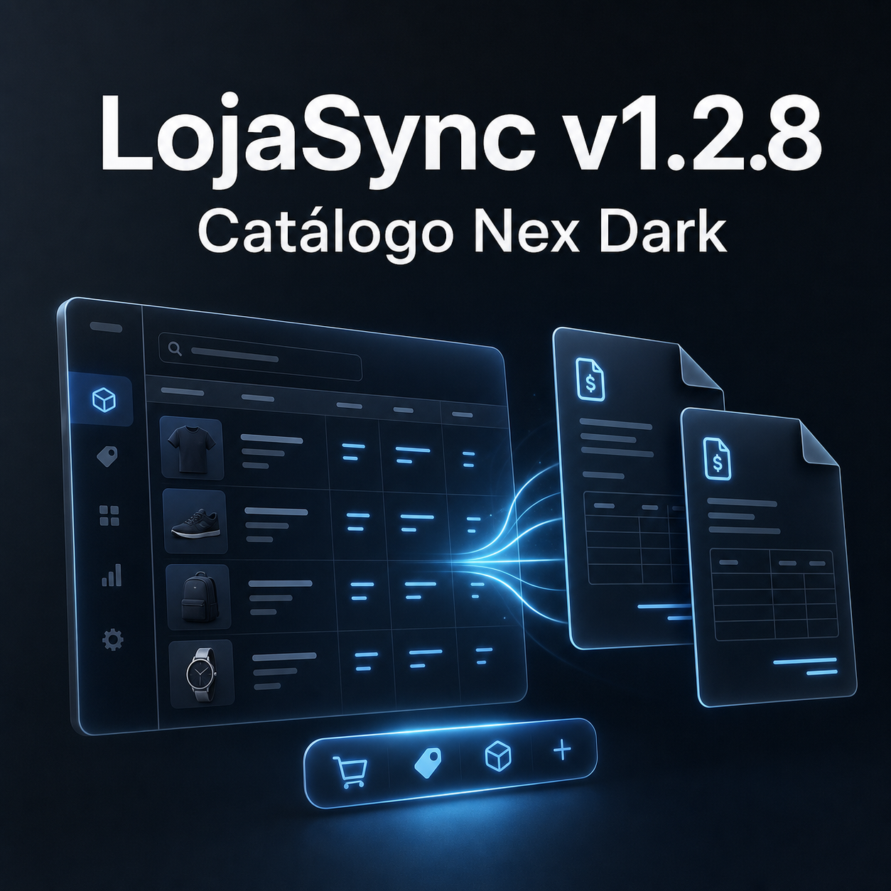

# v1.2.8 — Catálogo Nex Dark e importação visual

Data: 21/07/2026

LojaSync v1.2.8 transforma a interface principal em uma estação operacional Nex Dark, coloca o Catálogo no centro do fluxo e adiciona conferência visual de múltiplas notas sem mudar os contratos locais com o Byte Empresa.

## Mudanças percebidas

| Área | Trabalho confirmado | Como o usuário percebe |
| --- | --- | --- |
| Catálogo | Novo shell Nex Dark, navegação por workspaces e Catálogo como página inicial | Mais área útil para produtos, leitura compacta e ações de fluxo sempre próximas |
| Cadastro | Dock do Catálogo e cadastro manual flutuante, arrastável e não bloqueante | É possível cadastrar sem perder a lista de vista; Enter avança pelos campos |
| Importação | Prévia de PDF, imagem e TXT; lote com layout automático, movimento e redimensionamento | Uma ou várias notas podem ser conferidas e organizadas durante a importação |
| Modos de leitura | IA e leitura local continuam escolhas independentes e explícitas | Cada adição de notas informa claramente qual processamento será usado |
| Diagnóstico | Códigos estruturados de rejeição e mensagens específicas em português | Divergência de total, quantidade ou ausência de itens aparece com motivo acionável |
| Segurança operacional | Parada global durante automação e polling tolerante a falha transitória | O operador mantém o comando de parada em qualquer workspace e jobs não somem numa oscilação |
| Histórico | Workspace com eventos reais e controles de desfazer/refazer | A atividade local fica consultável sem inventar estados que o backend não registra |
| Documentação | Índice e guias de desenvolvimento, operação e release consolidados | Manutenção e publicação seguem um caminho menor e verificável |

## Sessões auditadas desde v1.2.7

### OpenCode — trabalho incorporado

- Sessão principal `ses_0852de289ffeWFP14k0cbzb7el`: adaptação do brand kit ao LojaSync.
- Nove subagentes de UX, risco, plano, implementação e polimento: `stellar-tiger`, `happy-harbor`, `happy-cabin`, `quiet-garden`, `glowing-panda`, `swift-cabin`, `silent-meadow`, `clever-engine` e `quick-cabin`.
- Resultado incorporado: shell e Catálogo Nex Dark, dock, cadastro flutuante, histórico, wallpaper e bundle inicial.

### Claude — trabalho incorporado

- `60977fa5-facb-44dd-9e9c-ccb776eb3c3f`: opacidade e rótulos do dock, fluxo de cadastro por Enter e ajustes do painel flutuante.
- `4250dce7-8152-4e72-b365-7919b67cb7f5`: workspace visual da importação, múltiplos documentos, preview, drag/resize, lote sequencial e diagnóstico estruturado.

### Codex — auditoria e release

- Sessão de 21/07: comparação local/GitHub, inventário de agentes, revisão independente de padrões e especificação, correções de integração, testes, metadados, arte e publicação.
- Correções incorporadas: retry de polling sem apagar job ativo, escolha explícita do modo ao adicionar notas, parada global e remoção de bytes NUL do TypeScript.

### Ferramentas auditadas sem autoria atribuível no período

- ZCode: aplicação ativa em 17/07, mas zero sessão com diretório LojaSync nos bancos locais após o corte de v1.2.7.
- Trae Work: atividade recente encontrada apenas em outros projetos; nenhuma sessão LojaSync posterior ao release.
- Wispr Flow: atividade do aplicativo até 20/07, sem vínculo de sessão ou arquivo com o repositório; classificado como possível entrada de voz, não autoria de código.

### Alterações sem agente comprovável

- Dois commits já sincronizados com o GitHub antes desta release reorganizaram patch notes e documentação. O Git registra apenas o autor proprietário, portanto não foi atribuída uma ferramenta sem evidência.

## Reconciliação Git

- Base oficial: `v1.2.7` (`70e90f4`).
- Antes da preparação, `main`, `origin/main` e o merge-base apontavam para `15cf3b1`; não havia commit local à frente nem commit remoto ausente.
- Havia apenas um worktree e uma branch local: `main`.
- O ZIP do brand kit e `showcase-site/` foram preservados como materiais locais fora do release.
- Fontes, testes, wallpaper e bundle versionado foram reconciliados no mesmo patch.

## Qualidade e compatibilidade

- Sem migração de SQLite e sem breaking change de API.
- Auth continua opcional/legado.
- IA e leitura local permanecem independentes.
- Parada da automação permanece acessível durante execução.
- Validação completa: 171 testes backend aprovados, 122 testes frontend aprovados, TypeScript/Vite com 61 módulos, OpenAPI com 49 paths e `git diff --check` aprovado.

---

Base: `v1.2.7` → `v1.2.8`

Publicação: `main`, tag `v1.2.8` e GitHub Release.
